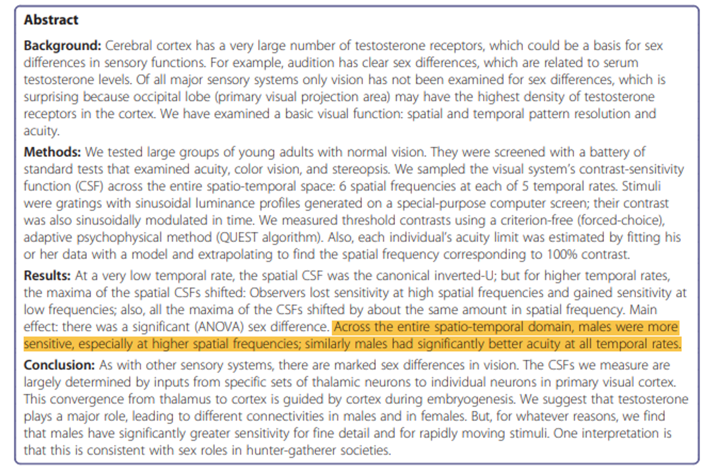
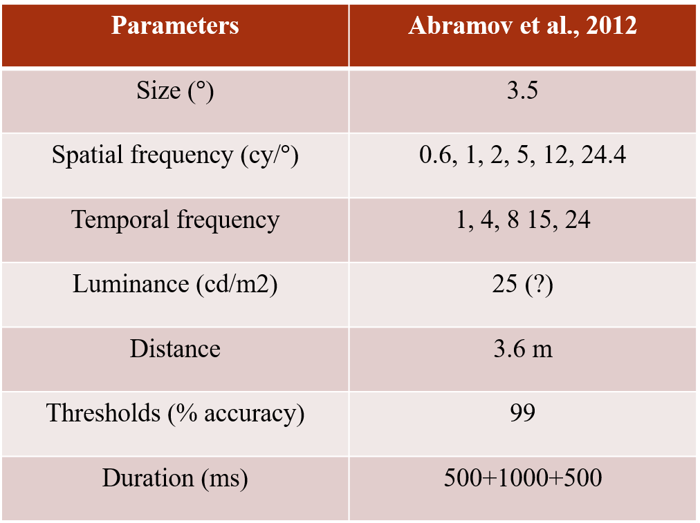
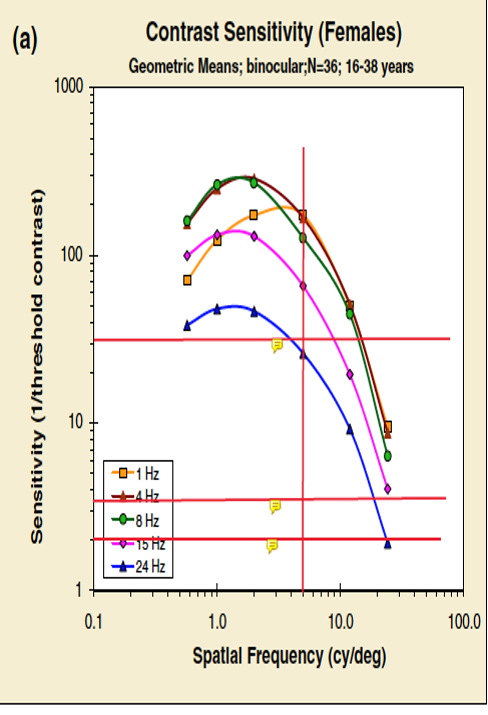
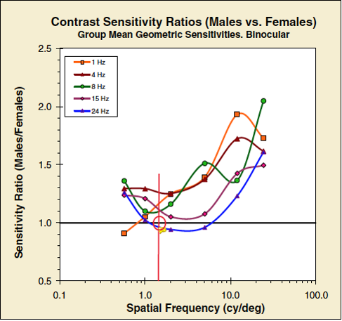
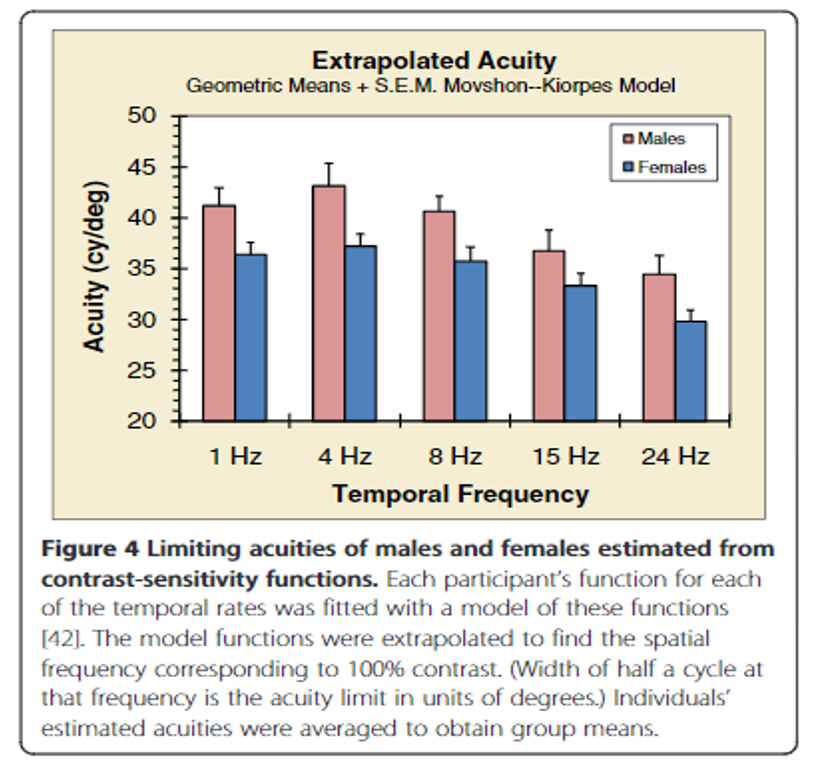

# Three Points for Reading a Paper

## Why does this paper matter?

- Read carefully of just skim  
- The goal of this research  
- Why is it interesting for us to think/talk about?

## What does it talk about?

- Research Question?
- Hypotheses?
- Findingis?

## What are the methods it used?

- Population (age, gender, ...), time, locations, etc.
- What are DVs and IVs?
- How are thy measuresed? Why to use it rather than the other?

# My Reading Sequence

1. Abstract
- Very, very important
- It can answer most of the above questions
- If you find terminiology you are not familiar with, what do you do?

2. Methods + Analysis

3. Result part
- Plots

4. Reflections
- Was the research question answered in this paper?
- Did the methods measure what the researchers want to measure?
- Were the finidings consistent with the hypotheses? Do they suprise you?

5. Find some explanations in the introductions and discussion part

# Lets Do It!

Abramov, I., Gordon, J., Feldman, O., & Chavarga, A. (2012). Sex & vision I: Spatio-temporal resolution. Biology of Sex Differences, 3(1), 20.

# Example Abstract

# Methods

- Participant
36 females [16-38] Mean = 23.5
16 males [16-37] Mean = 24.3
- Measures
    - Visual Acuity
    - Color Vision
    - Binocular Depth perception (stereopsis)
    - **Contrast sensitivity task**
- Stimuli

What are DVs and IVs?

# Relate Plot with Main Findings    

Ratio 

Mean +- Standard Error 

# Discussion

- Any questions about this paper?
- Was the research question answered in this paper?
- Did the methods measure what the researchers want to measure?
- Do the findings surprise you?
- What is the implication of these findings?
- Any critique? What can be improved in this study?
