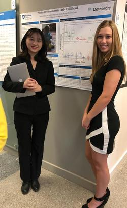
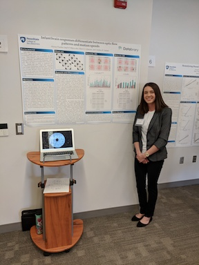

 

# Rick Gilmore's Lab @ Penn State

The Gilmore Lab in the [Psychology Department](http://psych.la.psu.edu) at [Penn State](http://www.psu.edu) studies the development of perception, action, and memory. Our goal is to understand patterns of brain and behavioral change in infants, children, and young adults. We use behavioral, EEG, MRI, and computational modeling methods in our research. We also advocate for and try to demonstrate open science practices in our work. 

<!-- ## Active Projects -->

<!-- We have several active projects related to visual perception and open science that are described [here](research.html). You can also get a taste of what we do by visiting the <a href="https://databrary.org">Databrary</a> digital data library, specifically the page devoted to <a href="https://databrary.org/party/6">our research</a>. -->

<!-- During the Spring 2019 semester, we are focusing on improving our collective data science chops thanks to the support of online training offered by  -->
<!--  -->
<!-- [**DataCamp**](http://www.datacamp.com). Thanks, DataCamp! -->

## Contact Information

Dr. [Rick Gilmore](https://psych.la.psu.edu/directory/rog1), Professor of Psychology, ([rogilmore@psu.edu](mailto:rogilmore@psu.edu); 814-865-3664; 114 Moore Building) directs the lab.

[Andrea Seisler](mailto:ars17@psu.edu) is the Lab Manager.

<!-- ## Testing Sites -->

<!-- We have two testing sites.  -->

<!-- ### 449 Moore -->

<!-- <p>Department of Psychology</br> -->
<!-- The Pennsylvania State University</br> -->
<!-- University Park, PA 16802</br> -->
<!-- 814-863-3116</br> -->
<!-- </p> -->
<!--  -->

<!-- Parking for studies at the Moore Building can be found in the Nittany Lion Parking Deck. -->

<!-- ### 120 Chandlee -->

<!-- <p>Human Electrophysiology Facility</br> -->
<!-- [Social, Life, & Engineering Sciences Imaging Center (SLEIC)](http://imaging.psu.edu)</br> -->
<!-- University Park, PA 16802</br> -->
<!-- </p> -->

<!-- Parking for studies at Chandlee can be found near the building. Our research staff will provide full instructions when we schedule a visit. -->

## [For Students](who-we-are.html)

The lab employs an active and engaged group of undergraduate and graduate research assistants. If you are a Penn State undergraduate student and wish to be considered for a position in the lab, complete an online application [here](https://docs.google.com/forms/d/1HgafpfTVPyMk_Wzf4b_ubzig_fs4lFGS6qh_y0sa0uE/viewform).  If you are a prospective graduate student, contact Dr. Gilmore by email.  For more information about current students and alumni, see the [student page](who-we-are.html).

## [For Parents](parents.html)

Much of our research involves testing infants and young children. To sign-up for a study or learn more about what a visit entails please follow [this link](parents.html). 

## News

<center>
<h3>[PSI CHI](http://sites.psu.edu/psichi/) RESEARCH CONFERENCE!</h3>

Congratulations to our Undergraduate Research Assistants for presenting their posters during the annual Psi Chi Research Conference!  

<h4>Psi Chi 2019 Presenters</h4>

Sarah Shahriar presented her poster [On the move: A study on gait style and preference in early infancy](https://github.com/gilmore-lab/psi-chi-2019/blob/master/crawling-mode_files/Psi_Chi_Sarah_2019.pdf)


Zhichun Zhao and Ashton Dluzneski presented the poster they worked on with Sandy Rayes: [Motor Development in Early Childhood](https://github.com/gilmore-lab/psi-chi-2019/blob/master/object-play_files/Psi_Chi_ASZ_2019.pdf).



<h4>Psi Chi 2018 Presenters</h4>

Alyssa Pandos presented her poster [Infant brain responses differentiate between optic flow patterns and motion speeds](https://github.com/gilmore-lab/infant-moco-eeg/blob/master/pubs/psi-chi-2018-poster/pandos-gilmore-seisler-psichi-2018.pdf).  

2<sup>nd</sup> Place Empirical Research Category   

 

Charmi Mehta presented her poster [Reanalyzing Shared Data about Brains and Behavior](https://github.com/gilmore-lab/brain-behavior-data/blob/master/pubs/psi-chi-2018/mehta-psi-chi-2018.pdf). 

"
</center>

## DataCamp

Most students who work as research assistants in the lab do so for PSY 494 course credit.

This class is supported by DataCamp, an intuitive learning platform for data science. Learn R, Python and SQL the way you learn best through a combination of short expert videos and hands-on-the-keyboard exercises. Take over 100+ courses by expert instructors on topics such as importing data, data visualization or machine learning and learn faster through immediate and personalised feedback on every exercise.

```{r, echo=FALSE}
knitr::include_graphics("images/DataCamp-50px.png")
```


