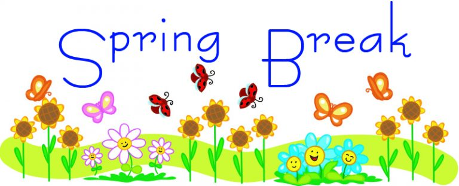

## Spring 2026

For the Spring 2026 Semester, we will meet on Wednesdays from 4:00-5:00 pm in room 444 Moore.

[Psych 494 Syllabus](https://psu-psychology.github.io/psych-494-gilmore/)

The [Gilmore Lab Manual](https://gilmore-lab.github.io/protocols/) contains many useful instructions for onboarding new lab members, required training, and connect RStudio and Github.

### Poster Presentation Opportunities
  - The [Undergraduate Exhibition](https://urfm.psu.edu/programs/undergraduate-exhibition) is April 20-22, 2026
    - 2/17: application available 
    - 3/17: application due date
    - 4/6: final materials due
    - 4/22: In-Person Poster Presentation, Alumni Hall, HUB

### Wednesday, March 18, 2026

0. Attending
1. Discuss @Hadad2015-qd

  - [Summary of Discussion](https://psu-psychology.github.io/psych-494-gilmore/2026-03-04-haddad-etal.html)

2. Poster Update
  - submitted the application 3/17.
  - plan to fully complete within the next two weeks

3. PLAY Coding project

```{r, coding-status-chunk, echo=FALSE}
# Load the knitr package
library(knitr)
library(kableExtra)

# Create Data Frame
coding_data <- data.frame(
  file_status = c("Total", "Completed", "Remaining", "Remaining/Wk"),
  n_files = c("75", "36", "39", "16.0")
)

# Generate the kable table
knitr::kable(coding_data, caption = "PLAY Coding Status 3/18/2026", col.names = c("File Status", "# Files")) %>%
  kable_styling(full_width = FALSE, position ="left", bootstrap_options = "condensed") %>%
  row_spec(., row = 0, bold = TRUE)
```

4. Homework

- Read @Blumberg2023-fs and possibly @Blumberg2023-ce

### Wednesday, March 11, 2026

{fig-align="left" width="60%"}

### Wednesday, March 4, 2026

0. Attending
1. Discuss @Hadad2015-qd

  - [Summary of Discussion](https://psu-psychology.github.io/psych-494-gilmore/2026-03-04-haddad-etal.html)
  
2. Poster Update

  - idea: present overall PLAY project
  
3. PLAY Coding project

```{r, coding-status-chunk2, echo=FALSE}
# Load the knitr package
library(knitr)
library(kableExtra)
options(knitr.table.format = "html")

# Create Data Frame
coding_data <- data.frame(
  file_status = c("Total", "Completed", "Remaining", "Remaining/Wk"),
  n_files = c("75", "43", "32", "11.1")
)

# Generate the kable table
kable(coding_data, caption = "PLAY Coding Status 3/3/2026", col.names = c("File Status", "# Files")) %>%
  kable_classic("hover", full_width = FALSE, html_font = "sans-serif") %>%
  row_spec(., row = 0, bold = TRUE)
```

### Wednesday, February 25, 2026

**Meeting CANCELLED**

Homework

- Read @Hadad2015-qd

### Wednesday, February 18, 2026

0. Attending
1. Discuss: @McIntire2026-rg

  - Adolescent Brain Cognitive Development Study [ABCD Study®](https://abcdstudy.org/)
  - [Belmont Report](https://www.hhs.gov/ohrp/regulations-and-policy/belmont-report/read-the-belmont-report/index.html#xbasic)


### Wednesday, February 11, 2026

0. Attending
1. Finish: @EIFL2018-lx
2. Homework:
  - Read: @McIntire2026-rg

### Wednesday, February 4, 2026

0. Attending
1. Play Coding
  - 9 files completed to date
  - 9 files per week until finished
2. Watch Video: @EIFL2018-lx
3. Homework: Submit suggestions to Discord for
  - Poster Presentation Topics
  - Journal Club Articles

### Wednesday, January 28, 2026

0. Attending
1. Discuss Paper: @D-Antonio2026-vo
  - [QUIPS tool](http://methods.cochrane.org/sites/methods.cochrane.org.prognosis/files/uploads/QUIPS%20tool.pdf)
  - [Summary of Discussion](https://psu-psychology.github.io/psych-494-gilmore/2026-01-28-dantonio-etal.html)

### Wednesday, January 21, 2026

0. Attending
1. Discuss Goals for this semester
2. Update on PLAY Coding project
3. Address any outstanding training
4. Poster Presentation Opportunities
  - [Psi Chi](https://sites.psu.edu/psichi/), the International Honor Society in Psychology, is hosting its annual  [Spring Research Conference](http://sites.psu.edu/psichi/research-conference-2/) in the spring. **Details not yet available**
  - The [Undergraduate Exhibition](https://urfm.psu.edu/programs/undergraduate-exhibition) is April 20-22, 2026
    - February: application will be available
    - 3/17: application due date
    - 4/22: In-Person Poster Presentation, Alumni Hall, HUB
5. Homework
  - Read: @D-Antonio2026-vo
  - Submit potential papers for Journal Club to the general channel on Discord
  - Poster ideas for April?
  
  


