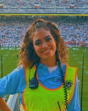

# For Interested Students

The Brain Development Lab, part of the [Psychology Department](https://psych.la.psu.edu) at Penn State, is looking for research assistants to study brain development in infants, children, and adolescents for **Fall 2022**. 
You can earn research project (PSY 494) credit or work study funds, and learn video, computer, and communication skills. Prior research experience and computer skills are a plus, but aren't required. 
We are especially interested in students who have morning availability, computer skills, or are interested in developing skills in advertising, marketing, or public relations. You may apply by completing an [application](https://docs.google.com/forms/d/1HgafpfTVPyMk_Wzf4b_ubzig_fs4lFGS6qh_y0sa0uE/viewform). **We are FULL for Spring 2022**.

## Lab Director

```{r, echo=FALSE}
knitr::include_graphics("images/rog-headshot175x220px.jpg")
```

Rick O. Gilmore is Professor of Psychology, a Huck Institute of the Life Sciences faculty member, and an Associate of the Institute for Cyberscience. 
He earned his bachelor's degree *magna cum laude* in Cognitive Science from [Brown University](https://www.brown.edu), and master's and doctoral degrees in Psychology from [Carnegie Mellon University](https://www.cmu.edu) where he participated in the [Center for the Neural Basis of Cognition (CNBC)](https://cnbc.cmu.edu) training program in cognitive neuroscience. 
Gilmore's research focuses on the development of visual perception and memory. 
He is particularly interested in the development of brain networks that enable perceivers to extract information about the layout of the environment, the shape of objects, and the speed and direction of self-movement from patterns of visual motion called optic flow. 
Gilmore is also keenly interested in developing tools and practices that make scientific research more open, transparent, and reproducible.
He is co-founder and Co-Director of the [Databrary.org](https://databrary.org) data library, and is co-PI on the Play & Learning Across a Year [(PLAY) Project](https://play-project.org). 
From 2008 to 2014, Gilmore served as the founding Director of Human Imaging at Penn State's Social, Life, and Engineering Sciences Imaging Center [(SLEIC)](https://imaging.psu.edu). 
He has won the College of the Liberal Arts tenure-line faculty teaching award, leads the Open Data in Developmental Science (ODDS) initiative for the Penn State Child Study Center, and has had support for his research from the National Institutes of Health and the National Science Foundation. 

Gilmore has served as president of the [Centre Region Bicycle Coalition](https://centrebike.org), the [Acoustic Brew Concert Series](https://acousticbrew.org), and the [State College Community Theatre](https://scctonline.org).
An active radio amateur or ham (callsign K3ROG), he is member of the Board of Directors of the [Nittany Amateur Radio Club](https://www.nittany-arc.net/) and is the faculty adviser and K3CR license trustee for the Penn State Amateur Radio Club.

#### Contact Information

<p>114 Moore Building<br/>
Department of Psychology<br/>
The Pennsylvania State University<br/>
University Park, PA 16801<br/>
814-865-3664, voice <br/>
814-863-7002, fax<br/>

rogilmore AT-SIGN psu DOT edu<br/>

[Meeting scheduler](https://doodle.com/mm/rickgilmore/book-a-time)

## Current Staff

### [Andrea Seisler](mailto:ars17@psu.edu), Lab Manager
Andrea R. Seisler is the Laboratory Manager of the Brain and Behavioral Development Laboratory directed by Dr. Rick O. Gilmore. She has also been the Support and Authorizations Specialist at [Databrary](https://databrary.org) since November 2016. She received her bachelor's and master's degree in Biomedical Engineering from [The Catholic University of America](https://www.cua.edu/). During her graduate studies, she was a recipient of the [Clare Booth Luce Fellowship](https://www.hluce.org/cblprogram.aspx) award.

She completed MRI based neuroscience and orthopedics research while working at [The National Institutes of Health](https://www.nih.gov/) from 2001-2007. After her move to State College, she served as an IRB Compliance Coordinator for the [Office for Research Protections](https://www.research.psu.edu/orp/humans) at Penn State and then moved on in 2009 to manage the Human Electrophysiology Facility located at the [Social, Life, and Enginineering Sciences Imaging Center](https://www.imaging.psu.edu/) through 2014. 

She is active in Scouts BSA as a Committee Member in [Troop 245](https://www.olvcatholicschool.org/Page/804) and an Executive Board Member of the [Juniata Valley Council, BSA](http://www.jvcbsa.org/about-us/council-leadership/18280). She completed her [Wood Badge](http://woodbadge.org/) leadership training course in September 2020. Now she is staffing the Wood Badge and [National Youth Leadership Training](https://www.ncacbsa.org/national-youth-leadership-training/) programs. In addition she enjoys dancing ballet and substitute teaching at [Dance Academy](https://www.dancesc.com/).

#### Contact Information

<p>503 Moore Building<br/>
Department of Psychology<br/>
The Pennsylvania State University<br/>
University Park, PA 16802<br/>
ars17 AT-SIGN psu DOT edu</p>

### Yiming Qian, Graduate Student

Yiming is a graduate student in the Department of Psychology at PSU. Her research interest is exploring the development of brain networks from early childhood to adulthood, using multimodal neuroimaging tools. She is also interested in the mechanism of visual motion. Here is her [schedule](https://rstudio-connect.tlt.psu.edu:3939/content/22/projects_scheme.html) for the current research projects.

Besides research activities, Yiming enjoys reading, cooking, gardening, hiking and fishing. She is a big fan of operas and musicals.

### Molly Askin, Undergraduate Research Assistant

Molly Askin is a sophomore at the Pennsylvania State University and is from New Jersey. She is majoring in Psychology with the Neuroscience option with a minor in neuroscience. She is involved in campus through Greek life in her sorority [Alpha Xi Delta](https://www.alphaxidelta.org/). She is also involved in [THON](https://thon.org/) as an assistant THON chair which consists of helping with anything the other THON chairs need help with as well as helping to raise money for THON. She is interested in pursuing her education further and eventually getting her PhD in neuropsychology with hopes to eventually study patients with Alzheimer’s and dementia. 

### Maureen Burke, Undergraduate Research Assistant

Maureen (Maggie) Burke is part of The Pennsylvania State University’s undergraduate class of 2022. She is majoring in Psychology (*neuroscience option*) with a minor in Biology. She is interested in child development and fine motor skills. In the future, she plans on attending graduate school for occupational therapy. This past summer she worked at [High Quality Home Therapy](https://www.hqhtherapy.com/) as an intern, where she shadowed occupational therapists and observed their practices. Outside of this lab, she is involved with [Life Link](https://lifelinkpsu.weebly.com/), a mentorship program offered to students with disabilities. Here, she aids students with navigation skills and attends college classes with them. She is also involved in [Psi Chi](https://sites.psu.edu/psichi/), the national psychological honor society. 


<!-- ### Sara Delmoral, Undergraduate Research Assistant -->
<!-- |   |   | -->
<!-- |:-|:-| -->
<!-- | |Sara Delmoral is currently a Junior at the Pennsylvania State University who is from Cliffwood Beach, New Jersey. She is double majoring in Biology with a focus in neuroscience as well as Psychology with a focus in neuroscience. She is pursuing a minor in Chinese as well. Sara is currently Vice President of the [Biological Science Society](https://orgcentral.psu.edu/organization/the-psu-biological-sciences-society) , a member of Penn State’s EMS squad, and a member of AED. Not only this, but she is a Liaison for FreshStart, a member of CASA, and works as a home health aide. Interested in cognitive and behavioral development, Sara plans to pursue medical school following her graduation in May 2023. Outside of studies, [Sara](https://www.linkedin.com/in/sara-delmoral-32489b1b3/) enjoys baking, exercising, reading, and painting. | -->
<!-- </br> -->

### Bowen (Iris) Deng, Undergraduate Research Assistant

Bowen is a junior student majoring in psychology with a
Neuroscience option. She is a member of the [CPSA](https://www.linkedin.com/company/psu-cpsa). Bowen is interested in clinic psychology and plan to apply medical school in the future. She can speak Chinese, English, and German. She enjoys traveling, cooking and watching TV series at leisure.

### Kavya Jhaveri, Undergraduate Research Assistant

Kavya Jhaveri is a junior at the Pennsylvania State University and is from Ahmedabad, India. She is pursuing a major in Psychology with the Neuroscience option, and is minoring in Mathematics and Neuroscience. She is a writing consultant at the [Penn State Learning Centre](https://pennstatelearning.psu.edu/tutoring/writing), and works at the [IM Building](https://studentaffairs.psu.edu/facilities-spaces/campus-recreation-facilities/im-building) on campus. She also plans to become involved in THON and contribute to the Daily Collegian on campus. She is an avid reader, an Indian classical dancer, and loves to paint. Kavya plans to go pursue a PhD in neuropsychology, or a related field, and eventually work with patients suffering from brain injury. 

### Anjali Jivan, Undergraduate Research Assistant

Anjali Jivan is in Pennsylvania State University’s undergraduate class of 2022 and is from Mumbai, India. She is majoring in Psychology with the Life Sciences option with minors in Early Childhood Education, Special Education and Rehabilitation and Human Services. She is involved with the Student Programming Association, [THON](https://thon.org/), and [Psi Chi Penn State](https://sites.psu.edu/psichi/) chapter on campus. She is interested in child and infant psychology, specifically areas that relate to cognitive and behavioral development. Following her undergraduate graduation, she plans to apply to an MD/Ph.D. program and eventually obtain licensure to become a practicing Child Psychologist. 

### Kayla Moninger, Undergraduate Research Assistant

|   |   |
|:-|:-|
| | Kayla Moninger is a Penn State student pursuing a degree in neuroscience with a minor in biology.  She is concurrently following the pre-medicine track with intentions of attending medical school to become a psychiatrist.  As a student, she is the Primary THON Chair and Family Relations Chair for Phi Eta Sigma, an honor society that also raises money for [THON]( https://thon.org/).  She is the Activities Coordinator for [Best Buddies]( https://www.bestbuddies.org/), an organization that pairs students with people in the area with disabilities.  She is also a member of PSU [RAM]( https://www.ramusa.org/), a global health-based nonprofit, and she volunteers as a hotline counselor at [Centre Safe]( https://www.centresafe.org/).  She is also a TA for a biology lab at Penn State, and her passion for studying the brain has led to her path of research in Dr. Gilmore’s lab. |
</br>

### Sydney (Belle) Peterson, Undergraduate Research Assistant  

|   |   |
|:-|:-|
| | Belle Peterson is a sophomore at the Pennsylvania State University from Northern California. She is majoring in Bio-Behavioral Health, with minors in Neuroscience and Biology. She is the co-founder of an artificial intelligence-based start-up, [Apoio](https://www.apoioclinica.com), which focuses on improving the intake process for mental health providers and providing greater access to care for patients. She is also involved with [Alpha Phi Omega](https://apo.org) and [Remote Area Medical](https://www.ramusa.org), both student-run community service groups. Belle plans to attend medical school after matriculation to specialize in pediatric and adolescent medicine. In her free time, Belle enjoys swimming, baking for her roommates, and white-water rafting. |
</br>

### Shahir Rayes, Undergraduate Research Assistant  

Shahir Rayes is majoring in Biology with a focus on Vertebrate Physiology. He was the President of We Are The World, a club at Penn State that is dedicated to promoting diversity and value students of all backgrounds and beliefs. He is also involved with [ Thon ](https://thon.org) on campus. Shahir is bilingual in both Arabic and English. Some of his hobbies are painting, lifting, and drawing. Shahir plans on going to medical school after graduation. 

### Kymberle Shields, Undergraduate Research Assistant

### Lakshmi Thangaraj, Undergraduate Research Assistant

Lakshmi Thangaraj is a sophomore at the Pennsylvania State University studying Biobehavioral Health with a minor in Neuroscience. She was born in a small town right outside of Boston, Massachusetts. On campus, Lakshmi is involved in [THON](https://thon.org/) and enjoys leisure running and exercise. Lakshmi is interested in cognitive and psychological development through adolescent stages. She plans on taking a clinical psych route in the neuroscience field of research. Other hobbies that Lakshmi has include reading and cooking, and her favorite show to watch is [*The Great British Bake Off*](https://en.wikipedia.org/wiki/The_Great_British_Bake_Off).

## Recent Alumni

- Michelle Mendez
- Rachel Chang
- Anna Capria
- Emily Herman
- Chelsea Davis
- Sandy Rayes
- Luka Kelly
- Amar Bhatia
- Zhichun Zhao
- Sarah Shahriar, Research Assistant, Penn State Hershey
- Ashton Dluzneski
- Alyssa Pandos  
- Charmi Mehta  
- Michael Dexheimer 
- Hifzah Malik
- Raya Willoughby
- Katie Torres
- Shivani Patel
- Michael O'Neill, Graduate student, PSU
- Daved Fared
- Auburn Lattanzio, Graduate student, Villanova University
- Michelle Shade
- Sam Pai
- Jun Oh, Apprentice Ruby on Rails Developer, Launch Academy, Inc.
- Amanda Thomas, Ph.D.
- William Adamiak, NIH IRTA
- Shivam Vedak, Medical student
- Dan Elbich, Graduate student, Penn State
- Jeremy Fesi, Ph.D., Research Analyst, U.S. Marine Corps
- Lorena Gonzalez, Graduate student, Penn State
- Ricky Groner, IT Support Specialist, Huck Institutes of the Life Sciences, Penn State
- Ken Hwang, Consultant, Anexinet
- Matthew Lee, MBA student, Penn State
- Patricia Jones, Optometry student, Pennsylvania College of Optometry
